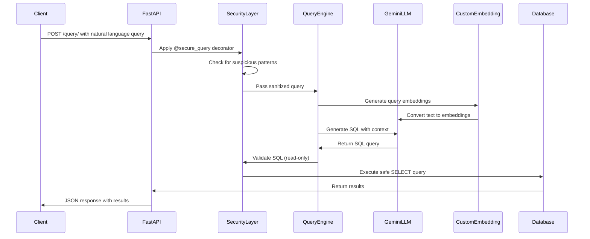

##**🚀 Conversational AI - LLM Backend**

This repository contains the backend for a Conversational AI system, built using FastAPI and Gemini LLM, with security layers, query processing, and embeddings for intelligent database interactions.

📌 Project Overview

🔥 Key Features

Natural Language Query Processing: Users can submit queries in plain language, which the system converts into structured SQL queries.

Secure Query Handling: A security layer ensures queries are sanitized and prevents malicious attacks.

Real-Time Query Execution: The backend processes queries efficiently, fetching results from the database in real time.

Embedding-Based Search: Advanced embeddings improve the accuracy of database searches.

Scalable & Fast: Built with FastAPI for high performance and scalability.

Flexible Deployment: Can be deployed on cloud servers or on-premise solutions.

🛠️ Tech Stack

Framework: FastAPI (Python)

LLM Model: Gemini LLM

Database: PostgreSQL

Security: Custom security layer for SQL validation

Hosting: Cloud or local server deployment

## 🏗️  System Architecture 


## Process Flow




## Developer Notes
    Updated Requirements.txt

    Do Not Change this README and IMPORT Statments from the main app 
    They are written in a way to not cause Import issue
    user python -m uvicorn main1:app --reload to run the app

    Query Body --->
    query:{
        "Write your prompt here"
    }


```
(⌐■_■)   < I code, therefore I am! >
     ╭───────────────╮
    / theguywithcode  \
   |    /////\\\\\\    |
   |   ///  o  o \\\   |
    \  ||    ∆    ||  /
     '--\   ---   /--'
         |_______|
        //       \\
       //         \\
     _//           \\_
    (__)           (__)


```


This is still under-development & not a complete build.

Release 1.0 will be comming soon
