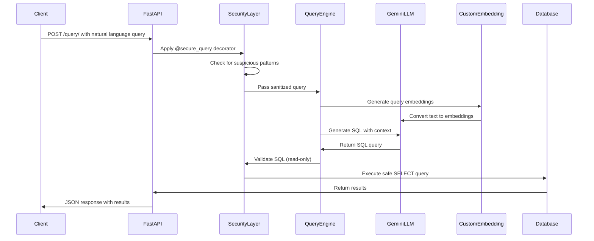

This is our LLM code for creating a conversational AI


## 🏗️  System Architecture 


## Process Flow




## Developer Notes
    Updated Requirements.txt

    Do Not Change this README and IMPORT Statments from the main app 
    They are written in a way to not cause Import issue
    user python -m uvicorn main1:app --reload to run the app

    Query Body --->
    query:{
        "Write your prompt here"
    }


```
(⌐■_■)   < I code, therefore I am! >
     ╭───────────────╮
    / theguywithcode  \
   |    /////\\\\\\    |
   |   ///  o  o \\\   |
    \  ||    ∆    ||  /
     '--\   ---   /--'
         |_______|
        //       \\
       //         \\
     _//           \\_
    (__)           (__)


```